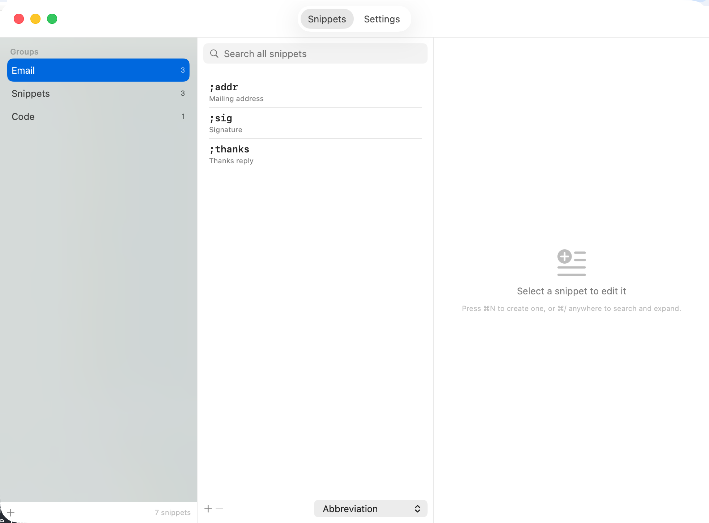

<div align="center">

# ⚡ SnipKey

**macOS 向けの無料・オープンソース・ネイティブ GUI のテキスト展開ツール — TextExpander の代替。**

ネイティブ Swift · Apple Silicon · サブスクなし · アカウントなし · ネットワーク接続なし

[](https://github.com/dkdannyboy/snipkey/releases/latest)
[](https://github.com/dkdannyboy/snipkey/releases)
[](LICENSE)
[](https://github.com/dkdannyboy/snipkey/releases/latest)
[](https://swift.org)

[English](README.md) · [한국어](README.ko.md) · **日本語**



</div>

---

どのアプリでも略語を入力すると、SnipKey が全文に置き換えます。`;sig` は署名に、
`;addr` は住所になります。メニューバーに常駐し、TextExpander のライブラリをワンクリック
で取り込み、入力したキーを Mac の外へ送りません。

## 機能

- **どこでもテキスト展開。** すべてのアプリで動作します。`;sig` → 署名。
- **どこでも検索 (⌘/)。** 略語を忘れても、どのアプリからでも略語・ラベル・内容で
  ライブラリ全体を検索し、Return で展開できます。
- **TextExpander からの移行。** すべてのグループ・略語・スニペットを取り込みます —
  フィルイン、ネストされたスニペット、クリップボードマクロも含めて。再入力は不要です。
- **フィルインフォーム。** スニペットが一旦止まって名前や金額を尋ねたり、リストから
  選ばせたりしてから、最終的なテキストを組み立てます。
- **複数 Mac の同期。** iCloud Drive や任意の同期フォルダで、複数の Mac に同じ
  ライブラリを — スニペットを失わないためのガードとともに。
- **3 言語対応。** English・한국어・日本語 を設定で即座に切り替え。
- **設計からプライベート。** アカウントも、テレメトリも、ネットワークコードも一切ありません。

## なぜ SnipKey？

テキスト展開ツールは既にいくつもあります — TextExpander 本体や、
[Espanso](https://espanso.org) のようなオープンソースのツール。SnipKey は、**ちゃんと
した GUI を備えたネイティブ Mac アプリ**、**TextExpander のライブラリをそのまま取り込む**、
**クラウドに何も置かない**——そういうものが欲しい人のためのものです。

| | **SnipKey** | TextExpander | Espanso |
|---|---|---|---|
| 価格 | **無料** | サブスク | 無料 |
| オープンソース | ✅ MIT | ❌ | ✅ |
| ネイティブ GUI エディタ | ✅ | ✅ | 設定ファイル(YAML) |
| TextExpander ワンクリック取り込み | ✅ | — | ❌ |
| アカウント不要・完全オフライン | ✅ | ❌ | ✅ |
| 日本語 / English / 한국어 の内蔵 UI | ✅ | ❌ | ❌ |

Espanso も優れています — 特に Linux・Windows も使いたいなら。SnipKey はあえて Mac
専用・GUI ファーストで、既存の TextExpander ライブラリを読み込むのでスニペットを一つも
失いません。

## インストール

macOS 13 以降が必要です。

**ダウンロード:** [最新リリース][releases]から `SnipKey.dmg` を取得し、開いて SnipKey を
アプリケーションフォルダへドラッグします。ディスクイメージは Apple による署名と公証を
受けているため、Gatekeeper の警告なしに開けます。

**Homebrew:**

```bash
brew tap dkdannyboy/tap
brew trust dkdannyboy/tap      # Homebrew はサードパーティ tap の信頼を確認します
brew install --cask snipkey
```

以降のアップデートは `brew upgrade --cask snipkey`。

初回起動時、セットアップアシスタントが必要な権限を一つ — **アクセシビリティ** — 案内
します。入力内容を見て代わりに入力するため、すべてのテキスト展開ツールがこの権限を
必要とします。入力した内容が Mac の外へ出ることはありません。

[releases]: https://github.com/dkdannyboy/snipkey/releases

## 展開のしくみ

記号で始まる略語（`;sig`、`/addr`、`,date`）は、入力し終えた瞬間に展開されます。記号が
あれば曖昧になりません。

`sig` のような裸の略語は、区切り文字（スペース、ピリオド、単語以外の文字）を入力する
まで展開を待ちます。そうしないといけません — `sig` は `signal` や `signature` の最初の
3 文字なので、即座に展開するとそれらの単語を入力できなくなります。`sig ` と入力すると、
署名の後にそのスペースが残ります。

**Return と Tab は裸の略語の区切り文字にしません** — 意図的にです。SnipKey はキーを
飲み込まずに監視するため、動けるようになった時点でキーはすでにアプリへ届いており、
Return と Tab は*何かをしてしまいます*: Slack では Return が送信、Tab は次の欄へ移動。
誤った場所で展開されるより、展開されない方がましです。スペースか記号で終えるか、
`;sig` 形式の略語を使ってください。

## 複数 Mac の同期

SnipKey は独自の同期サービスを持ちません。クラウドがすでに同期しているフォルダ
（iCloud Drive、Dropbox など）内のファイルを指定すると、クラウドが同期を行います。
**設定 → 同期** で:

- **Save Snippets As…** — 1 台目の Mac で、ライブラリを同期フォルダへコピーします。
- **Link to Snippets…** — 2 台目の Mac で、その同じファイルを指定します。
- **Don't Sync** — ローカル専用のライブラリに戻します。

共有ライブラリは簡単に壊れます — 2 台の Mac が同時に書き込む、まだダウンロードされて
いない iCloud のプレースホルダ、途中で終わった切り替え。SnipKey はスニペットを失う側に
なることを拒みます: 上書きの前にバックアップし、下でファイルが変わったら上書きせず
読み直し、新しいライブラリが正しく読めない限り場所を切り替えません。

## TextExpander からの移行

SnipKey は TextExpander 4/5 のデータを直接読み込みます。初回起動時に一般的な場所
（iCloud、Application Support、Dropbox、最新のローカルバックアップ）を探します。データが
別の場所にある場合は、**設定 → データ → Import from folder…** で
`.textexpandersettings` または `.textexpanderbackup` フォルダを選んでください。

書式付き（リッチテキスト）のスニペットはプレーンテキストとして取り込まれ、それ以外は
そのまま移行されます。

## マクロリファレンス

SnipKey は TextExpander のマクロ構文をそのまま使うため、取り込んだスニペットが動作し
続けます。

| マクロ | 動作 |
|---|---|
| `%filltext:name=X%` | 1 行のテキストを尋ねます |
| `%filltext:name=X:default=Y%` | …デフォルト値付き |
| `%fillarea:name=X%` | 複数行のテキストを尋ねます |
| `%fillpopup:name=X:one:two:default=one%` | リストから選ばせます |
| `%fillpart:name=X:default=yes%` … `%fillpartend%` | オンオフできる任意のセクション |
| `%snippet:;abbrev%` | 別のスニペットを挿入します（最大 10 段までネスト） |
| `%clipboard` | 現在のクリップボードのテキストを挿入します |
| `%date:yyyy-MM-dd%` | 日付・時刻を `DateFormatter` の書式で挿入します |
| <code>%&#124;</code> | 展開後、カーソルをここに置きます |
| `%key:enter%` | 展開後にキーを押します（`enter`、`tab`、`escape`、`space`） |

## キーボードショートカット

| ショートカット | 場所 | 動作 |
|---|---|---|
| `⌘/` | すべてのアプリ | スニペットを検索して選んだものを展開 |
| `⌘,` | すべてのウインドウ | 設定を開く |
| `⌘N` | SnipKey ウインドウ | 新規スニペット |
| `⌘F` | SnipKey ウインドウ | 検索フィールドにフォーカス |

## データの保存場所

| 内容 | パス |
|---|---|
| スニペットと設定 | `~/Library/Application Support/SnipKey/store.json` |
| トラブルシューティングログ | `~/Library/Logs/SnipKey.log` |

`store.json` はプレーンな JSON です。SnipKey がこのファイルを見つけても読めない場合、
その上に新しく始めることは**しません** — タイムスタンプ付きのコピーを残し、保存を拒み、
どうするか尋ねます。読み込み失敗でスニペットが上書きされることはありません。

## コントリビュート

Pull request を歓迎します。[CONTRIBUTING.md](CONTRIBUTING.md) を、特にバグのように
見えて意図的な動作の一覧をご覧ください。

```bash
git clone https://github.com/dkdannyboy/snipkey.git
cd snipkey
swift test                       # ユニットテスト
./scripts/build-app.sh --install # ビルドして /Applications にインストール
```

## ライセンス

MIT. [LICENSE](LICENSE) を参照してください。

## 商標

TextExpander および Espanso は各所有者の商標です。SnipKey は独立したオープンソース
プロジェクトであり、これらと提携・後援・推奨の関係はありません。「代替」はデータと動作
の互換性を指すもので、提携を意味しません。
